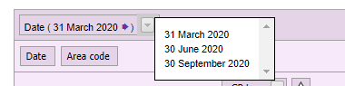

```{r setup, include=FALSE}
knitr::opts_chunk$set(echo = TRUE)
```

# My Scripts
This file will be my scripts of how/if I managed to get any data webscraped from sites such as Stats Wales & ONS (maybe some more).

## 1 - Packages
First step is to get load a few libraries which will be used.
```{r warning=FALSE}
library(knitr)
library(rvest)
library(tidyverse)
library(taRifx)
library(funModeling)
library(patchwork)
```

## 2 - Set URL
This section will have code which will set a URL, which will then be scraped together. First is number of gps employed in general practices.
```{r}
# set url
url <- 'https://statswales.gov.wales/Catalogue/Health-and-Social-Care/General-Medical-Services/number-of-gps-employed-in-general-practices'
# grab content from url
content <- read_html(url)
```

After setting the url, and grabbing the content from the url, lets go ahead and try to only get the contents which is part of the css field 'table'.
```{r}
get.tables <- content %>% 
  html_element("table") %>% 
  html_table()
```

now to subset the data as it is very messy and only keep the data which is actually important to us.
```{r}
# first only select what columns to keep
slice.one <- get.tables %>% 
  subset(select = 1:7)
# now select what rows to keep
slice.two <- slice.one[c(18:25),]
# only keep the gp staff data
mydf.staff.gp <- slice.two[1:7]
```

Now we have a decent dataset, lets go through at make sure the row names are correctly added.


```{r}
# kept row names in as can't add them later
# row.names1 = slice.two[,1]
# shorten the names manually.
row.names = c("Wales", "Betsi Cadwaladr Uni",
             "Powys Teaching", "Hywel Dda Uni",
             "Swansea Bay Uni", "Cwm Taf Morgannwg Uni",
             "Aneurin Bevan Uni", "Cardiff and Vale Uni")


# set the names of the table (should be sliced but typing is easier atm.)
col.names <- c("Local Health Board",
              "GP Partner/Provider/SPartner","Salaried",
              "GP Practitioner", "GP Registrar",
              "GP Retainer", "GP Locum")

# Apply the names to the table (slice.two)
mydf.staff.gp <- setNames(mydf.staff.gp, col.names)
```

Within the data, there are a few columns which are doubles, example "1,200" - this will need to be converted to a numeric value, which can be done by assigning x value with x as a numeric. (This was done by looking at the value and assigning it as it is typed out instead.)

Also noticed there are 2 symbols within our tibble which isn't required and will slow down the next steps, these symbols are "-" and "*" - lets attempt to replace these with 0's.
```{r}
df.staff.gp <- data.frame(mydf.staff.gp)

# replace the "-", "*", "*" with 0's
df.staff.gp$GP.Retainer[3:5] <- c(0,0,0)

df.staff.gp$GP.Retainer %>% mean()

# replace doubles to numeric
# df.staff.gp <- lapply(df.staff.gp[-1], destring)
# this gave me issues, so is done manually below.

# can be done manually.
df.staff.gp$GP.Partner.Provider.SPartner[1] <- 1467
df.staff.gp$GP.Practitioner[1] <- 1963
print(df.staff.gp)

names(df.staff.gp) <- tolower(names(df.staff.gp))
# remove spaces
names(df.staff.gp) <- sub(" ", "_", names(df.staff.gp))
```

Firstly, it looks like the date from the website has been defaulted to the older date, and I was unable to switch it to work with this code. I will be mindful with this going forward.




Now that the data has been sliced and carefully selected the parts of the data to keep,
I want to try and get the Total added onto the end of the table which will make analysing it a bit easier.

```{r}
# check column classes
sapply(df.staff.gp, class)
# get list of the character classes
chars <- sapply(df.staff.gp, is.character)
# replace all chars with numeric instead
df.staff.gp[ , chars] <- as.data.frame(apply(df.staff.gp[ , chars], 2, as.numeric))
# sanity check it worked
sapply(df.staff.gp, class)
# write.csv(df.staff.gp, "data/staff-per-gp.csv")
```
There was a few issues with the data, as it was a mix of characters, strings and doubles (obviously) - So above, I tried to 'sapply' through each column to see which were characters, save these as a list and check the characters against the numeric entries and encode them as numeric. A bit confusing, I know but it worked.

Next lets try to get the Total of staff in GPs across Wales

```{r}
# sum up the rows
# write.csv(df.staff.gp, file = "data/gp-number-check.csv")
df.staff.gp$total <- rowSums(df.staff.gp[,c(-1)])
# plot the data
barplot(df.staff.gp$total, main = "Total staff employed per local health board", 
        xlab = "Local Health Board", 
        ylab = "Total", 
        horiz = F, 
        col = rainbow(8), 
        legend.text = row.names, 
        args.legend = list(x = "topright"))
```

This plot could be nicer, with the use of ggplot2. This package gives you a lot of control over creating plots which can be both a positive and a negative. 

```{r}
plot.one <- 
  ggplot(df.staff.gp, aes(row.names, total, fill = row.names)) + 
  geom_col() +
  geom_text(aes(label = total, y = (total/2)), size = 3) + 
  labs(title = "Number of general practitioners in employment", 
       subtitle = "per local health board (30-September-2020)") +
  theme(axis.title.x = element_blank(),
        axis.text.x = element_blank(),
        axis.ticks.x = element_blank())

plot.one
  
```

From looking at the plot above it looks like Wales is the Total of all over districts, lets do a sanity check to see if this is correct (if not, look into how these local health boards are set up for better context.)

```{r results='asis'}
gp.districts <- 
  (942 + 1095 + 851 + 765 + 581 + 263 + 694)

print(gp.districts)

print(5160 - (gp.districts))
#kable(gp.districts, caption = "Sanity check of GP districts")
# write.csv(x = df.staff.gp, "gp-Totals.csv", row.names = T)
```
It looks like there seems to be 31 entries missing from this dataset, this will have to be kept in mind going forward.

```{r}
df.no.wales <- df.staff.gp[2:7] 
df.no.wales <- df.no.wales[c(-1),]
head(df.no.wales)

# shorten the names manually.
row.names1 = c("Betsi Cadwaladr Uni",
             "Powys Teaching", 
             "Hywel Dda Uni",
             "Swansea Bay Uni", 
             "Cwm Taf Morgannwg Uni",
             "Aneurin Bevan Uni", 
             "Cardiff and Vale Uni")


# set the names of the table (should be sliced but typing is easier atm.)
col.names1 <- c("GP Partner/Provider/SPartner","Salaried",
              "GP Practitioner", "GP Registrar",
              "GP Retainer", "GP Locum")

# Apply the names to the table 
df.no.wales <- setNames(df.no.wales, col.names1)
# add Total again
df.no.wales$Total <- rowSums(df.no.wales)
# name col names to lower
names(df.no.wales) <- tolower(names(df.no.wales))
# remove spaces
names(df.no.wales) <- sub(" ", "_", names(df.no.wales))
df.no.wales$health_board <- row.names1
```

Now we have removed 'Wales', lets create another plot but without Wales this time, just the health boards across wales.

```{r}
plot.one.no.wales <- 
  ggplot(df.no.wales, aes(health_board, total, fill = health_board)) + 
  geom_col() + geom_text(aes(label = total, y = (total/2)), size = 3) 
# write.csv(df.no.wales, file = "data/number-of-general.csv")

```

Here we can also pull some descriotive analysis from the dataset using a library called funModeling.

```{r}

profiling_num(df.no.wales)

str(df.no.wales)
df_status(df.no.wales)

# write.csv(profiling_num(df.no.wales), file = "data/desc-gps-employed.csv")
```

## 2.X - Plots for Normality.
This section will be a few histograms and boxplots to look for normality and any outliers within the data. 


```{r}
# GP Partners
# save this plot as png
gpPartnerHist <- 
  hist(df.no.wales$`gp_partner/provider/spartner`,
     main = toupper("Histogram of GP Partner/Provider/SPartner"),
     xlab = "Approximately normally distributed data",
     col = "pink")
# plot a boxplot
gpPartnerBoxplot <- 
  boxplot(df.no.wales$`gp_partner/provider/spartner`,
        main = toupper("Boxplot of the GP Partner/Provider/SPartner"),
        xlab = "Staff Boxplot",
        ylab = "Frequency",
        col = "pink")

# Salaried 
gpSalariedHist <- 
  hist(df.no.wales$salaried,
     main = toupper("Histogram of Salaried"),
     xlab = "Approximately normally distributed data",
     col = "pink")
# plot a boxplot
gpSalariedBox <- 
  boxplot(df.no.wales$salaried,
     main = toupper("Boxplot of the Salaried"),
     xlab = "Salaried Boxplot",
     ylab = "Frequency",
     col = "pink")
# GP Practitioner
gpPractitionerHist <- hist(df.no.wales$gp_practitioner,
     main = toupper("Histogram of GP Practitioner"),
     xlab = "Approximately normally distributed data",
     col = "pink")
# plot a boxplot
gpPractitionerBox <- boxplot(df.no.wales$gp_practitioner,
     main = toupper("Boxplot of the GP Practitioner"),
     xlab = "GP Practitioner Boxplot",
     ylab = "Frequency",
     col = "pink")
# GP Registrar
gpRegistrarHist <- 
  hist(df.no.wales$gp_registrar,
     main = toupper("Histogram of GP Registrar"),
     xlab = "Approximately normally distributed data",
     col = "pink")
# plot a boxplot
gpRegistrarBox <- 
  boxplot(df.no.wales$gp_registrar,
     main = toupper("Boxplot of GP Registrar"),
     xlab = "GP Registrar Boxplot",
     ylab = "Frequency",
     col = "pink")
# GP Retainer
gpRetainerHist <- 
  hist(df.no.wales$gp_retainer,
     main = toupper("Histogram of GP Retainer"),
     xlab = "Approximately normally distributed data",
     col = "pink")
# plot a boxplot
gpRetainerBox <- 
  boxplot(df.no.wales$gp_retainer,
     main = toupper("Boxplot of GP Retainer"),
     xlab = "GP Retainer Boxplot",
     ylab = "Frequency",
     col = "pink")
# GP Locum
gpLocumHist <- 
  hist(df.no.wales$gp_locum,
     main = toupper("Histogram of GP Locum"),
     xlab = "Approximately normally distributed data",
     col = "pink")
# plot a boxplot
gpLocumBox <- 
  boxplot(df.no.wales$gp_locum,
     main = toupper("Boxplot of GP Locum"),
     xlab = "GP Locum Boxplot",
     ylab = "Frequency",
     col = "pink")
# Total
gpTotalHist <- 
  hist(df.no.wales$total,
     main = toupper("Histogram of Total"),
     xlab = "Approximately normally distributed data",
     col = "pink")
# plot a boxplot
gpTotalHist <- 
  boxplot(df.no.wales$total,
     main = toupper("Boxplot of Total"),
     xlab = "Total Boxplot",
     ylab = "Frequency",
     col = "pink")
```

Now we have the staff employed per HB within Wales, it would be interesting to see how the population is within these HB areas.
I will try to do the same thing as above, but with a different dataset.

```{r}
# set new url
url.pop <- "https://statswales.gov.wales/Catalogue/Population-and-Migration/Population/Estimates/Local-Health-Boards/populationestimates-by-welshhealthboard-year"
# grab content from url
content.pop <- read_html(url.pop)
# grab the tables from the page
get.tables.pop <- content.pop %>% 
  html_element("table") %>% 
  html_table()
```

This table seems to be much bigger than the first one, so some of the script might need tweaking.

```{r}
# first only select what columns to keep
slice.pop1 <- get.tables.pop %>% 
  subset(select = 2:14)
# now select what rows to keep
slice.pop2 <- slice.pop1[c(25:32),]
# drop the area code
slice.pop3 <- slice.pop2[c(-2)]

# get the years
slice.pop.years <- get.tables.pop[15:25]
slice.pop.years <- slice.pop.years[c(18),]

# get the areas
slice.pop.areas <- slice.pop3[1]

# Get all data without areas
df.pop <- slice.pop3[-1]
# set the column names (years)
df.pop <- setNames(df.pop, slice.pop.years)

```

This has sliced the data correctly, but now we need to convert it from char/list to numeric again.

```{r}
# de-string the numbers ( ## this was an issue >.< ## )
df.pop <- lapply(df.pop, destring)
# check the class again
class(df.pop)
# the class is a list, which we want as a dataframe again as numeric.
df.pop <- data.frame(matrix(unlist(df.pop),
                            ncol = 11, 
                            nrow = 8),
                     stringsAsFactors = FALSE)
# finally converted from character/list to df.
class(df.pop)
```
Here we have managed to convert the data which was a lot harder this time with a lot of types (doubles, characters and lists) - this was made easier with a package discovered on 05/07/2021 called 'taRifx' and using 'destring'.

Now that the data has been stripped and converted, we need to add the column names and row names again, to create a plots like above with Wales and without Wales.

```{r}
# get the years, but only keep the years and remove 'Mid-year'
# and trim the white space, just to make sure.
slice.pop.years <-
  slice.pop.years %>% 
  str_replace_all('Mid-year', '') %>% 
  trimws()
# add the col names with setNames
df.pop <- setNames(df.pop, slice.pop.years)
# column bind the Health Board Areas with df.pop
df.pop <- cbind(slice.pop.areas, df.pop)
# sanity check
df.pop
df.pop <- rename(df.pop, "Health Board" = "X2")
# add Total again
df.pop$Total <- rowSums(df.pop[-1])
# name col names to lower
names(df.pop) <- tolower(names(df.pop))
# remove spaces
names(df.pop) <- sub(" ", "_", names(df.pop))

# now remove wales
df.pop.no.wales <- df
# save df.pop without wales
df.pop.no.wales <- df.pop[-1,]
# renamre the health boards
df.pop.no.wales$health_board <- row.names1
```

Now to try and plot the Total population per health board.

```{r}
# update the col names pop
col.names.pop <- c("Health Board", slice.pop.years)

plot.two <- 
  ggplot(df.pop, aes(health_board, total, fill = health_board)) + 
  geom_col() +
  geom_text(aes(label = total, y = (total/2)), size = 3) + 
  labs(title = "Population estimates", subtitle = "by local health boards and year (2009:2019)") +
  theme(axis.title.x = element_blank(),
        axis.text.x = element_blank(),
        axis.ticks.x = element_blank())
```

Now to try it without Wales again, which is throwing off the plot.

```{r}
#write.csv(df.pop.no.wales, 'pop-estimates.csv')
plot.two.no.wales <- 
  ggplot(df.pop[-1,], aes(health_board, total, fill = health_board)) + 
  geom_col() + 
  geom_text(aes(label = total, y = (total/2)), size = 3) + 
  labs(title = "Population estimates", 
       subtitle = "by local health boards and year (2009 - 2019)") +
  theme(axis.title.x = element_blank(),
        axis.text.x = element_blank(),
        axis.ticks.x = element_blank())
# write.csv(df.pop.no.wales, file = "data/pop-estimations.csv")
```
This data would be interesting to see side by side.
```{r}
noWalesA <- 
  ggplot(df.no.wales, aes(health_board, total, fill = health_board)) + 
  geom_col() + 
  geom_text(aes(label = total, y = (total/2)), size = 3) +
  labs(title = str_to_title("Number of general practitioners in employment"),
       subtitle = str_to_title("per local health board")) + 
  labs(title = str_to_title("GPs Employed")) + theme(axis.title.x = element_blank(),
        axis.text.x = element_blank(),
        axis.ticks.x = element_blank())


noWalesB <- 
  ggplot(df.pop.no.wales, aes(health_board, total, fill = health_board)) + 
  geom_col() + 
  geom_text(aes(label = total, y = (total/2)), size = 3) + 
  labs(title = str_to_title("Population estimates"), 
       subtitle = str_to_title("by local health boards and year ")) +
  theme(axis.title.x = element_blank(),
        axis.text.x = element_blank(),
        axis.ticks.x = element_blank())


noWalesA + 
  noWalesB + 
  plot_layout(nrow = 2, guides = "collect")
```

Before moving on to some descriptive statistics and hypothesis testing, lets first get a little look at the data for normality again with some plots.

```{r eval=FALSE, include=FALSE}
# 2009
pop2009Hist <- 
  hist(df.pop.no.wales$`2009`,
     main = toupper("Histogram of Population Estimates 2009"),
     xlab = "Approximately normally distributed data",
     col = "pink")
# plot a boxplot
pop2009Box <- 
  boxplot(df.pop.no.wales$`2009`,
     main = toupper("Boxplot of Population Estimates 2009"),
     xlab = "2009 Boxplot",
     ylab = "Frequency",
     col = "pink")
# 2010
pop2010Hist <- 
  hist(df.pop.no.wales$`2010`,
     main = toupper("Histogram of Population Estimates 2010"),
     xlab = "Approximately normally distributed data",
     col = "pink")
# plot a boxplot
pop2010Box <- 
  boxplot(df.pop.no.wales$`2010`,
     main = toupper("Boxplot of Population Estimates 2010"),
     xlab = "2010 Boxplot",
     ylab = "Frequency",
     col = "pink")
pop2011Hist <- 
  hist(df.pop.no.wales$`2011`,
     main = toupper("Histogram of Population Estimates 2011"),
     xlab = "Approximately normally distributed data",
     col = "pink")
# plot a boxplot
pop2011Box <- 
  boxplot(df.pop.no.wales$`2011`,
     main = toupper("Boxplot of Population Estimates 2011"),
     xlab = "2011 Boxplot",
     ylab = "Frequency",
     col = "pink")
# 2012
pop2012Hist <- 
  hist(df.pop.no.wales$`2012`,
     main = toupper("Histogram of Population Estimates 2012"),
     xlab = "Approximately normally distributed data",
     col = "pink")
# plot a boxplot
pop2012Box <- 
  boxplot(df.pop.no.wales$`2012`,
     main = toupper("Boxplot of Population Estimates 2012"),
     xlab = "2012 Boxplot",
     ylab = "Frequency",
     col = "pink")
# 2013
pop2013Hist <- 
  hist(df.pop.no.wales$`2013`,
     main = toupper("Histogram of Population Estimates 2013"),
     xlab = "Approximately normally distributed data",
     col = "pink")
# plot a boxplot
pop2013Box <- 
  boxplot(df.pop.no.wales$`2013`,
     main = toupper("Boxplot of Population Estimates 2013"),
     xlab = "2013 Boxplot",
     ylab = "Frequency",
     col = "pink")
# 2014
pop2014Hist <- 
  hist(df.pop.no.wales$`2014`,
     main = toupper("Histogram of Population Estimates 2014"),
     xlab = "Approximately normally distributed data",
     col = "pink")
# plot a boxplot
pop2014Box <- 
  boxplot(df.pop.no.wales$`2014`,
     main = toupper("Boxplot of Population Estimates 2014"),
     xlab = "2014 Boxplot",
     ylab = "Frequency",
     col = "pink")
# 2015
pop2015Hist <- 
  hist(df.pop.no.wales$`2015`,
     main = toupper("Histogram of Population Estimates 2015"),
     xlab = "Approximately normally distributed data",
     col = "pink")
# plot a boxplot
pop2015Box <- 
  boxplot(df.pop.no.wales$`2015`,
     main = toupper("Boxplot of Population Estimates 2015"),
     xlab = "2015 Boxplot",
     ylab = "Frequency",
     col = "pink")
# 2016
pop2016Hist <- 
  hist(df.pop.no.wales$`2016`,
     main = toupper("Histogram of Population Estimates 2016"),
     xlab = "Approximately normally distributed data",
     col = "pink")
# plot a boxplot
pop2016Box <- 
  boxplot(df.pop.no.wales$`2016`,
     main = toupper("Boxplot of Population Estimates 2016"),
     xlab = "2016 Boxplot",
     ylab = "Frequency",
     col = "pink")
# 2017
pop2017Hist <- 
  hist(df.pop.no.wales$`2017`,
     main = toupper("Histogram of Population Estimates 2017"),
     xlab = "Approximately normally distributed data",
     col = "pink")
# plot a boxplot
pop2017Box <- 
  boxplot(df.pop.no.wales$`2017`,
     main = toupper("Boxplot of Population Estimates 2017"),
     xlab = "2017 Boxplot",
     ylab = "Frequency",
     col = "pink")
# 2018
pop2018Hist <- 
  hist(df.pop.no.wales$`2018`,
     main = toupper("Histogram of Population Estimates 2018"),
     xlab = "Approximately normally distributed data",
     col = "pink")
# plot a boxplot
pop2018Box <- 
  boxplot(df.pop.no.wales$`2018`,
     main = toupper("Boxplot of Population Estimates 2018"),
     xlab = "2018 Boxplot",
     ylab = "Frequency",
     col = "pink")
# 2019
pop2019Hist <- 
  hist(df.pop.no.wales$`2019`,
     main = toupper("Histogram of Population Estimates 2019"),
     xlab = "Approximately normally distributed data",
     col = "pink")
# plot a boxplot
pop2019Box <- 
  boxplot(df.pop.no.wales$`2019`,
     main = toupper("Boxplot of Population Estimates 2019"),
     xlab = "2019 Boxplot",
     ylab = "Frequency",
     col = "pink")
# total
popTotalHist <- 
  hist(df.pop.no.wales$Total,
     main = toupper("Histogram of Population Estimates Total"),
     xlab = "Approximately normally distributed data",
     col = "pink")
# plot a boxplot
popTotalBox <- 
  boxplot(df.pop.no.wales$`Total`,
     main = toupper("Boxplot of Population Estimates Total"),
     xlab = "Total Boxplot",
     ylab = "Frequency",
     col = "pink")
```

- _That was a lot of plots!!_

This data can also be 'profiled' to draw out some descriptive statistics from the data frame.
```{r}
structure(df.pop.no.wales)
descPopNoWales <- str(df.pop.no.wales)
#write.csv(descPopNoWales, "data/tidy/desc-pop-no-wales.csv")
profiling_num(df.pop.no.wales)

# write.csv(profiling_num(df.pop.no.wales), file = "data/desc-population.csv")
```

Now lets try to do a time series ( big ask :P ) with the dataset, the data might need to be manipulated even more, but lets see.
```{r}
# remove health board
tempD <- df.pop[-1]
# remove Wales
tempD <- tempD[-1,]
# remove Total
tempD <- tempD[1:11]
```   

```{r}
# create a time series object as tempD
tempD %>% ts(start = 2009, frequency = 1) -> tempTS
flipD <- t(tempD) 
flipNames <- t(slice.pop.areas) 
flipNames <- flipNames[-1]
flipD <- colnames(flipNames)

# create a time vector
time <- 1:length(flipD)
# check the summary
summary(flipD)

#plot.ts(flipD)
```

## 3 - Exploring just Aneurin Bevan

This section will be used to try and do something with just the area of Aneurin Bevan hopefully looking at the GPs vs Population estimates in one table and maybe doing something with the time series data.

The rest of this will be continued in a different RMD file, to focus on new data sets to try and join.

```{r}
df.bevan1 <- rbind(df.pop.no.wales[6,])
df.bevan2 <- df.no.wales[6,]
print(paste(round(df.bevan1$Total/df.bevan2$Total), "people need to be seen by 1 doctor."))

# add a random entry to the dataframe
visitsPer1K = vector() 
# visitsPer1K$LHB <- row.names1

```


```{r citations, message=FALSE, warning=FALSE, include=FALSE, paged.print=FALSE}
citation(package = "knitr")
citation(package = "rvest")
citation(package = "tidyverse")
citation(package = "taRifx")
```


```{r}
# write.csv(df.pop.no.wales, "data/population-estimates.csv")
# Remove everything which we no longer need to free up some memory/RAM.
# rm(list = ls())
# gc()
```

### - Other datasets to look at:
- [Population by area, ethnicity and gender](https://statswales.gov.wales/Catalogue/Equality-and-Diversity/Ethnicity/Census-2001/Population-by-Area-Ethnicity-Gender)

- [Population estimates by ethnicity and year](https://statswales.gov.wales/Catalogue/Equality-and-Diversity/Equality/Population-Estimates-by-Ethnicity-Year)

- [Population estimates by local authority and ethnicity](https://statswales.gov.wales/Catalogue/Population-and-Migration/Population/Estimates/Ethnicity/PopulationEstimates-by-Localauthority-Ethnicity)

- [Population estimates by local authority, ethnicity and age](https://statswales.gov.wales/Catalogue/Equality-and-Diversity/Ethnicity/Population-Estimates/PopulationEstimates-by-LocalAuthority-Ethnicity-Age)

- [Population estimates by local authority, gender and ethnicity](https://statswales.gov.wales/Catalogue/Equality-and-Diversity/Ethnicity/Population-Estimates/PopulationEstimates-by-LocalAuthority-Gender-Ethnicity)

- [Population estimates by year and National Park](https://statswales.gov.wales/Catalogue/Population-and-Migration/Population/Estimates/National-Park/PopulationEstimates-by-Year-NationalPark)

- [Population projection components of change by year and National park area](https://statswales.gov.wales/Catalogue/Population-and-Migration/Population/Projections/National-Park/2014-Based/populationprojectioncomponentsofchange-by-year-nationalparkarea)

- [Population projections by year and national park](https://statswales.gov.wales/Catalogue/Population-and-Migration/Population/Projections/National-Park/2013-based/populationprojections-by-year-nationalpark)

- [Population projections by year and national park](https://statswales.gov.wales/Catalogue/Population-and-Migration/Population/Projections/National-Park/2014-Based/populationprojections-by-year-nationalpark)

- [Private household population by national park and year](https://statswales.gov.wales/Catalogue/Housing/Households/Projections/National-Park/2013-based/privatehouseholdpopulation-by-nationalpark-year)

- [Private household population by national park and year](https://statswales.gov.wales/Catalogue/Housing/Households/Projections/National-Park/2014-Based/privatehouseholdpopulation-by-nationalpark-year)

- [Projected private household population by local authority and year](https://statswales.gov.wales/Catalogue/Housing/Households/Projections/Local-Authority/2011-Based/ProjectedPrivateHouseholdPopulation-by-LocalAuthority-Year)

- [Projected private household population by year](https://statswales.gov.wales/Catalogue/Housing/Households/Projections/National/2011-Based/ProjectedPrivateHouseholdPopulation-by-Year)